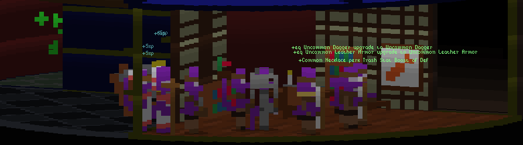
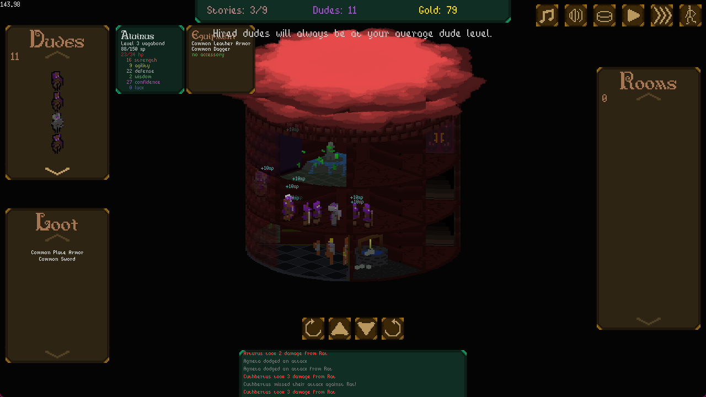

# Tower of Purgatory

Send a party of androgynous animal dudes up a tower that you build! Watch 'em level up! Sell their loot! Buy them equipment! Make bank off taxing them! And maybe, just maybe, they can escape the tower of purgatory into the wondrous clouds above!

This a faux-3D tower builder and light RPG simulator written for the third [ebitengine game jam](https://itch.io/jam/ebitengine-game-jam-2024)

## Features

- Weird 2D rendering creating a faux 3D effect!
- Build each level of the tower!
- RPG for your lil dudes!
  - Leveling!
  - EXP Gain!
  - Equipment managing!
  - Random loot!
  - Excessive notifications!
- Progressive enemies and room types!
- Bosses!
- Potentially endless gameplay!
- Dynamic music based upon room placement!

## Building & Running

`go run . build` thenr `go run . run`
